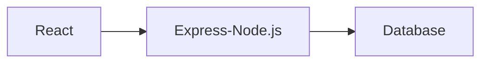

# Workshop Overview - Frontend app (React), Backend Rest API (Express.js)

In this workshop, we will be learning how to build a simple but functional web application that follows a 3-tier architecture pattern. The workshop will follow the principles outlined below:

1. The workshop is divided into multiple parts, with each part building a functional component of the overall system.
2. Each subsequent part will add new functionality, starting with simple features and gradually adding more advanced ones.
3. Project ideas will be kept realistic so that students can relate to them in the real world.
4. Project ideas will be divided into multiple epics and stories, as in any big organization.
5. One epic will be completed in each part of the workshop. Code for each part can be downloaded from the GitHub repository.

## 3-Tier Architecture

A 3-tier architecture pattern separates an application into three distinct layers: presentation layer, business logic layer, and data storage layer. The presentation layer, or Frontend layer, or UI layer, is responsible for rendering the application user interface. The business logic layer, or middle tier, or backend layer, is responsible for processing requests and responses between the UI layer and data storage layer. The data storage layer is responsible for storing and retrieving application data.

## Tech Stack

Choosing a tech stack for a project is a tough decision as there are many popular frameworks and programming languages for each layer of the 3-tier architecture. For this workshop, we will use the following tech stack:

1. React for UI development. Learn more about React from the official website (https://react.dev/learn).
2. Express.js (Node.js) for REST API backend application. Learn more about Express.js from the official website (https://expressjs.com/).
3. PostgreSQL for databases. Learn more at the PostgreSQL site (https://www.postgresqltutorial.com/).

As we move to more advanced topics, we may explore cloud deployment options and other cloud-native services.

## Project

In this workshop, we will be building a CRUD (Create, Read, Update, Delete) application for Schools listing and search tool. The UI layer of the application will be built using React, the middle tier will be built using Express.js (Node.js) for the REST API backend, and the data storage layer will be handled by PostgreSQL.

### Epics and Stories

To keep the project organized and manageable, we will divide it into multiple epics and stories:

- Epic 1: Setting up the Project
  - Story 1: Setting up the ReactJS frontend project
  - Story 2: Setting up the Express.js backend project
  - Story 3: Configuring PostgreSQL for data storage

- Epic 2: Building the React UI
  - Story 1: Creating the UI layout and design
  - Story 2: Implementing the UI components for displaying a list of schools
  - Story 3: Implementing the UI components for adding new schools
  - Story 4: Implementing the UI components for updating schools
  - Story 5: Implementing the UI components for deleting schools

- Epic 3: Building the Express.js REST API
  - Story 1: Creating API endpoints for retrieving schools
  - Story 2: Creating an API endpoint for adding new schools
  - Story 3: Creating an API endpoint for updating schools
  - Story 4: Creating an API endpoint for deleting schools

- Epic 4: Integrating the React UI with the Express.js REST API
  - Story 1: Adding API calls to retrieve schools from the Express.js API
  - Story 2: Adding API calls to add new schools through the Express.js API
  - Story 3: Adding API calls to update existing schools through the Express.js API
  - Story 4: Adding API calls to delete schools through the Express.js API
  - Story 5: Testing the integration between the React UI and Express.js REST API

- Epic 5: Deploying to the Cloud
  - Story 1: Setting up the cloud environment
  - Story 2: Configuring the application to run on the cloud platform
  - Story 3: Deploying the React UI to the cloud
  - Story 4: Deploying the Express.js REST API to the cloud
  - Story 5: Testing the deployed application on the cloud

- Epic 6: Adding Authentication and Authorization
  - Story 1: Setting up authentication and authorization
  - Story 2: Implementing user registration and login functionality
  - Story 3: Restricting access to the UI and API endpoints based on user roles
  - Story 4: Implementing password reset functionality
  - Story 5: Testing the authentication and authorization functionality

## Tools

For the development of this application, we recommend using Visual Studio Code as the code editor. However, you can use any other code editor that you are comfortable with. Here are some popular development tools that you may find helpful for this workshop:

1. [Visual Studio Code](https://code.visualstudio.com/): A lightweight and versatile code editor with great support for React and Express.js (Node.js) development.

2. [IntelliJ IDEA](https://www.jetbrains.com/idea/): A popular and powerful integrated development environment (IDE) for Java development with advanced code analysis and debugging tools.

3. [Postman](https://www.postman.com/): A powerful tool for testing and debugging RESTful APIs.

4. [Git](https://git-scm.com/downloads): A version control system that allows you to keep track of changes to your code and collaborate with others.

5. [GitHub](https://github.com/): A web-based platform for hosting Git repositories and collaborating on projects with others.

## References

Here are some references that you can use to further enhance your skills related to the technologies used in this workshop:

- **ReactJS**
  - Official ReactJS Documentation: https://react.dev/learn

- **Express.js (Node.js)**
  - Official Express.js Documentation: https://expressjs.com/

- **PostgreSQL**
  - Official PostgreSQL Documentation: https://www.postgresql.org/docs/

Additionally, you can also refer to the documentation and tutorials provided by the development tools that you will be using in this workshop, such as Visual Studio Code, Git, and GitHub.

By the end of this workshop, you will have a basic understanding of the 3-tier architecture pattern and how to build a web application using ReactJS for the frontend and Express.js for the REST API backend. You will also be able to extend the application with additional features and functionality. So, let's get started!

