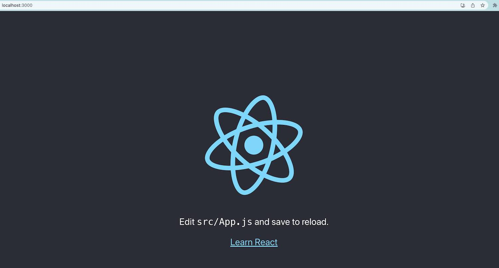

# Build a Schools Listing React Application

In this chapter, we will focus on building a simple React UI app with basic CRUD (Create, Read, Update, and Delete) operations. The app will be about **Schools Listing** where users can add, update, remove schools' details such as school name, grades, city, state, country, zip code, and view the list of schools. We will use a real MongoDB database for CRUD operations.

:::tip
This workshop focuses on providing you with hands-on experience in building a complete solution for Front-End UI, Backend API, database, and cloud deployment. While we cover the technologies used in this workshop, we may not be able to delve into each technology in depth. Therefore, we recommend further studying all the technologies and frameworks by referring to their documentation. Refer to [Further Learning Section](#further-learning) for resources.
:::

## 1. Setting up the Development Environment
Before we start building our app, we need to set up the development environment. To build the UI app, we will use Node.js and React.js. Follow these steps to set up the development environment:

### Install Node.JS
1. Install `Node.js` from the official website if you haven't already. You can download it from here: https://nodejs.org/en/download/.
1. To verify that `Node.js` has been installed successfully, open your terminal and run the following command:
  ```
  node -v
  ```
  If the command returns the version of `Node.js`, it means that `Node.js` has been installed correctly.

1. Install `npx` globally using `npm` (Node Package Manager) by running the following command:
  :::info
  npx is a command-line utility built into npm (Node Package Manager) version 5.2 or later. It is used to execute Node.js packages without having to install them globally. 
  :::

   ```
   npm install -g npx
   ```

### Create Project Directory
1. Create a new directory `react-express-workshop` by running the following command:
  ```
  mkdir react-express-workshop
  ```
1. Change the directory to `react-express-workshop`
  ```
  cd react-express-workshop
  ```

### Create React App
1. Create a new React app named `schools-listing-frontend` by running the following command:
  ```
  npx create-react-app schools-listing-frontend
  ```
  If you get the following message, say yes and enter.
   
  `Need to install the following packages: create-react-app@x.x.x
    Ok to proceed? (y) y`

2. Once the app is created, navigate to the `schools-listing-frontend` directory by running the following command:
   ```
   cd schools-listing-frontend
   ```

### Run React App
Once you have generated the initial React app, navigate to the root directory of the app using the command prompt or terminal and enter the following command:
  ```
  npm start
  ```
  This will start the development server and open the app in your default browser at [http://localhost:3000](http://localhost:3000). You can now start making changes to the app and see the changes reflected in the browser in real-time.

  If the app is running, you should see the React default page in the browser.

  

:::tip
To stop the development server, you can press `CTRL + C` in the command prompt or terminal.
:::

### Open project in IDE

Open the project directory (schools-listing-frontend) in Visual Studio Code or your preferred text editor or IDE.

--------------

## 2. Create the Schools Listing UI components
Now that we have set up our development environment, let's start creating the UI components for our app. In React, UI components are created using JSX syntax, which allows you to write HTML-like code in JavaScript.

We will create the following components for our app:

- App.js - The main component that renders other components

### App.js component
The App.js file serves as the entry point and main component of a React application. It is responsible for rendering the user interface and managing the state and behavior of the application.

The App.js file typically contains the root component that represents the entire application. It defines the structure and layout of the application's UI by composing and rendering other components. It also manages the application's state and handles any necessary data fetching, updates, or event handling.

:::info
We are adding all of the initial UI components in the same App.js file for simplicity. We are not using any CSS or UI framework at the moment. However, in later chapters, we will refactor our code by moving these components into separate files to improve organization and modularity. See [Further Learning](#further-learning) section for UI and JavaScript frameworks.
:::


```javascript
import React, { useState, useEffect } from 'react';

const API_BASE_URL = 'http://localhost:3002'; // Update this with your backend API URL

const App = () => {
  // State variables
  const [schools, setSchools] = useState([]);
  const [selectedSchool, setSelectedSchool] = useState(null);

  // Fetch schools data when the component mounts
  useEffect(() => {
    getSchools();
  }, []);

  // Function to fetch the list of schools from the backend
  const getSchools = async () => {
    try {
      const response = await fetch(`${API_BASE_URL}/schools`);
      const data = await response.json();
      setSchools(data);
    } catch (error) {
      console.log('Error fetching schools:', error);
    }
  };

  // Function to delete a school from the backend
  const deleteSchool = async (id) => {
    try {
      await fetch(`${API_BASE_URL}/schools/${id}`, {
        method: 'DELETE',
      });
      getSchools(); // Refresh the schools list after deletion
    } catch (error) {
      console.log('Error deleting school:', error);
    }
  };

  // Function to update a school in the backend
  const updateSchool = async (selectedSchool) => {
    try {
      await fetch(`${API_BASE_URL}/schools/${selectedSchool.id}`, {
        method: 'PUT',
        headers: {
          'Content-Type': 'application/json',
        },
        body: JSON.stringify(selectedSchool),
      });
      getSchools(); // Refresh the schools list after update
    } catch (error) {
      console.log('Error updating school:', error);
    }
  };

  // Function to add a new school to the backend
  const addSchool = async (school) => {
    try {
      await fetch(`${API_BASE_URL}/schools`, {
        method: 'POST',
        headers: {
          'Content-Type': 'application/json',
        },
        body: JSON.stringify(school),
      });
      getSchools(); // Refresh the schools list after addition
    } catch (error) {
      console.log('Error adding school:', error);
    }
  };

  // Function to render the table of schools
  const renderSchools = () => {
    if (!schools || schools.length === 0) {
      return <p>No Data Found</p>;
    }

    return (
      <table>
        <thead>
          <tr>
            <th>Select</th>
            <th>School Name</th>
            <th>Grades</th>
            <th>City</th>
            <th>State</th>
            <th>Country</th>
            <th>Zip Code</th>
            <th>Actions</th>
          </tr>
        </thead>
        <tbody>
          {schools.map((school) => (
            <tr key={school.id}>
              {/* Radio button for selection */}
              <td>
                <input
                  type='radio'
                  name='schoolRecord'
                  onClick={() => setSelectedSchool(school)}
                />
              </td>
              <td>{school.name}</td>
              <td>{school.grades}</td>
              <td>{school.city}</td>
              <td>{school.state}</td>
              <td>{school.country}</td>
              <td>{school.zipCode}</td>
              <td>
                {/* Delete button */}
                <button onClick={() => deleteSchool(school.id)}>Delete</button>
              </td>
            </tr>
          ))}
        </tbody>
      </table>
    );
  };

  // Function to handle the form submission for adding a school
  const handleSubmit = (event) => {
    event.preventDefault();
    const { name, grades, city, state, country, zipCode } = event.target.elements;
    const school = {
      name: name.value,
      grades: grades.value,
      city: city.value,
      state: state.value,
      country: country.value,
      zipCode: zipCode.value,
    };
    addSchool(school); // Add the new school to the backend
    event.target.reset();
  };

  // Function to render the Add School form
  const renderAddSchoolForm = () => {
    return (
      <div>
        <h2>Add School</h2>
        <form onSubmit={handleSubmit}>
          <input name='name' placeholder='Name' />
          <input name='grades' placeholder='Grades' />
          <input name='city' placeholder='City' />
          <input name='state' placeholder='State' />
          <input name='country' placeholder='Country' />
          <input name='zipCode' placeholder='Zip Code' />
          <button type='submit'>Add</button>
        </form>
      </div>
    );
  };

  // Function to render the Update School form
  const renderUpdateSchoolForm = () => {
    // Function to handle input changes in the Update School form
    const handleChange = (event) => {
      setSelectedSchool({
        ...selectedSchool,
        [event.target.name]: event.target.value,
      });
    };

    return (
      <>
        <h2>Update School</h2>
        {/* Use the ID of the selected school */}
        <input type='hidden' name='id' defaultValue={selectedSchool.id} />
        <input
          name='name'
          value={selectedSchool.name}
          onChange={handleChange}
          placeholder='Name'
        />
        <input
          name='grades'
          value={selectedSchool.grades}
          onChange={handleChange}
          placeholder='Grades'
        />
        <input
          name='city'
          value={selectedSchool.city}
          onChange={handleChange}
          placeholder='City'
        />
        <input
          name='state'
          value={selectedSchool.state}
          onChange={handleChange}
          placeholder='State'
        />
        <input
          name='country'
          value={selectedSchool.country}
          onChange={handleChange}
          placeholder='Country'
        />
        <input
          name='zipCode'
          value={selectedSchool.zipCode}
          onChange={handleChange}
          placeholder='Zip Code'
        />
        <button onClick={() => updateSchool(selectedSchool)}>Update</button>
        <button onClick={() => setSelectedSchool(null)}>Cancel</button>
      </>
    );
  };

  // Render the main UI of the app
  return (
    <div>
      <h1>Schools Listing App</h1>
      <div>
        {/* Render the table of schools */}
        {renderSchools()}
        {/* Render the Add School form */}
        {selectedSchool ? (
          // Render the Update School form when a school is selected
          renderUpdateSchoolForm()
        ) : (
          // Render the Add School form when no school is selected
          renderAddSchoolForm()
        )}
      </div>
    </div>
  );
};

export default App;

```

Explanation:

1. We import the necessary dependencies from React, including `useState` and `useEffect` hooks, which allow us to manage state and handle side effects respectively.

2. We set the `API_BASE_URL` constant to the backend API URL. Make sure to update this URL with the correct backend API URL that you are using.

3. We define the `App` component, which serves as the main component of our React application.

4. Inside the `App` component, we define state variables using the `useState` hook: `schools` to store the list of schools retrieved from the backend, and `selectedSchool` to keep track of the school selected for update.

5. We use the `useEffect` hook to fetch the list of schools from the backend API when the component mounts. The `getSchools` function is an asynchronous function that uses the Fetch API to perform a GET request to the backend endpoint `/schools`. The received data is then set to the `schools` state.

6. We define three functions for interacting with the backend API: `deleteSchool`, `updateSchool`, and `addSchool`. These functions use the Fetch API to perform DELETE, PUT, and POST requests, respectively, to the corresponding backend endpoints for managing schools.

7. The `renderSchools` function is responsible for rendering the table of schools. It checks if there are schools available and then maps through the `schools` array to create table rows. Each row displays school information, and there is a radio button for selecting a school for update and a delete button for deleting the school.

8. The `handleSubmit` function handles the form submission for adding a new school. It extracts the form values and creates a new school object. Then, it calls the `addSchool` function to add the new school to the backend.

9. The `renderAddSchoolForm` function renders the form for adding a new school. It displays input fields for the school's name, grades, city, state, country, and zip code, along with a submit button.

10. The `renderUpdateSchoolForm` function renders the form for updating a selected school. It pre-fills the form fields with the existing school information, and it updates the `selectedSchool` state when there are changes in the input fields. The form includes an update button to trigger the `updateSchool` function and a cancel button to clear the selected school.

11. Finally, the main UI is rendered inside the `return` statement. It displays the header "Schools Listing App" and renders the list of schools and either the Add School form or the Update School form based on whether a school is selected or not. If a school is selected, the Update School form is shown; otherwise, the Add School form is shown.


## 3. Running the Application

To run the application, open a terminal or command prompt, navigate to the root directory of the `schools-listing-frontend` project, and execute the following command:

```bash
npm start
```

This will start the development server, and the application will open in your default web browser at [http://localhost:3000](http://localhost:3000).

At this point, you should see the heading "Schools Listing App" and a message saying "No Data Found" on the web page. This is expected because we haven't built the backend REST API yet. The frontend React app is currently trying to fetch data from the backend, but since the API endpoints don't exist, it shows the "No Data Found" message.

In the next chapter, we will build the backend REST API using Node.js, Express, and MongoDB. Once the backend API is ready, we will come back to the frontend React app and connect it to the backend to perform CRUD operations on the schools data.

Stay tuned for the next chapter, where we'll dive into building the backend REST API!

## Conclusion

Congratulations! You have successfully built a simple React application for managing schools' data with basic CRUD operations. In this tutorial, you learned how to set up a development environment, create React components, use React hooks, manage state, and interact with a real MongoDB database using the Fetch API to perform CRUD operations.

Remember, this is just a basic example, and there's much more you can do to enhance this application. Some possible improvements include:

- Styling the UI with CSS or using UI libraries like Bootstrap or Material UI.
- Implementing user authentication and authorization to secure the application.
- Adding form validation for better user experience.

Feel free to explore these enhancements and take this application to the next level. Happy coding!

## Further Learning

To continue learning and improving your React skills, consider exploring the following resources:

- Official React Documentation: https://reactjs.org/docs/getting-started.html
- React Hooks: https://reactjs.org/docs/hooks-intro.html
- React Router: https://reactrouter.com/web/guides/quick-start
- CSS Styling: https://developer.mozilla.org/en-US/docs/Learn/CSS
- UI Frameworks: Bootstrap (https://getbootstrap.com/) and Material UI (https://mui.com/)
- Real Backend with Node.js and Express: https://expressjs.com/
- Database with MongoDB: https://www.mongodb.com/
