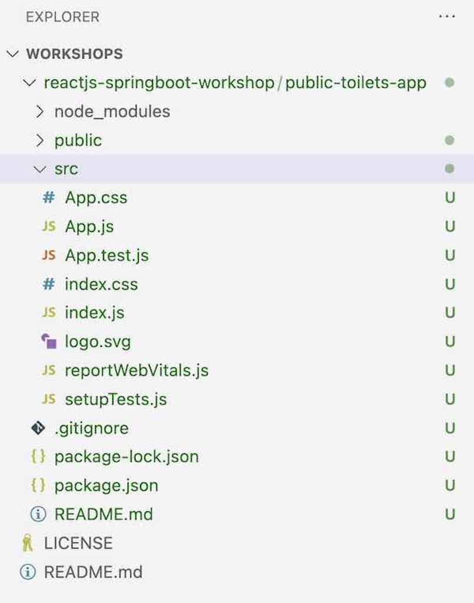

# Chapter 1: Building a Simple React Application

In this chapter, we will focus on building a simple ReactJS UI app with basic CRUD (Create, Read, Update, and Delete) operations. The app will be about **Schools Listing** where users can add, update, remove schools' details such as school name, grades, city, state, country, zip code, and view the list of schools. We will use an in-memory array in the UI app for CRUD operations.

:::tip
This workshop focuses on providing you with hands-on experience in building a complete solution for Front-End UI, Backend API, database, and cloud deployment. While we cover the technologies used in this workshop, we may not be able to delve into each technology in depth. Therefore, we recommend further studying all the technologies and frameworks by referring to their documentation. Refer to [Further Learning Section](#further-learning) for resources.
:::

## 1. Setting up the Development Environment
Before we start building our app, we need to set up the development environment. To build the UI app, we will use Node.js and ReactJS. Follow these steps to set up the development environment:

### Install Node.JS
1. Open your terminal or command prompt.

2. Install `Node.js` from the official website if you haven't already. You can download it from here: https://nodejs.org/en/download/.

3. To verify that `Node.js` has been installed successfully, open your terminal and run the following command:
   ```
   node -v
   ```
   If the command returns the version of `Node.js`, it means that `Node.js` has been installed correctly.

4. Install `npx` globally using `npm` (Node Package Manager) by running the following command:
  :::info
  npx is a command-line utility built into npm (Node Package Manager) version 5.2 or later. It is used to execute Node.js packages without having to install them globally. 
  :::

   ```
   npm install -g npx
   ```

### Create ReactJs App
1. Create a new ReactJS app named `schools-listing-app` by running the following command:
   ```
   npx create-react-app schools-listing-app
   ```
   If you get the following message, say yes and enter.
   
   `Need to install the following packages: create-react-app@x.x.x
    Ok to proceed? (y) y`

2. Once the app is created, navigate to the `schools-listing-app` directory by running the following command:
   ```
   cd schools-listing-app
   ```

3. Install the necessary dependencies.
   To install the necessary dependencies, run the following command:
   ```
   npm install
   ```

### Run React App

Once you have generated the initial ReactJS app, navigate to the root directory of the app using the command prompt or terminal and enter the following command:
  ```
  npm start
  ```
  This will start the development server and open the app in your default browser at [http://localhost:3000](http://localhost:3000). You can now start making changes to the app and see the changes reflected in the browser in real-time.

  If the app is running, you should see the ReactJS default page in the browser.

  

:::tip
To stop the development server, you can press `CTRL + C` in the command prompt or terminal.
:::

### Open project in IDE

Open the project directory (schools-listing-app) in Visual Studio Code or your preferred text editor or IDE. You should see the files as shown below.



### Github Repo
:::note
You can refer to and clone the code up to this section from the GitHub repository using the `initial-react-app` branch.

To clone the repository, you can use the following command:

```bash
git clone --branch initial-react-app https://github.com/your-github-username/schools-listing-app.git
```

This will clone the repository and checkout the `initial-react-app` branch, which contains the code up to this section of the workshop.

You can then navigate to the `schools-listing-app` directory to access the React app code:

```bash
cd schools-listing-app/
```

From there, you can explore the code and continue with the workshop.
:::

That's it for this section! 🎉 We now have a new ReactJS app named `schools-listing-app` running. In the next section, we will add actual UI components.


## 2. Create the Schools UI components
Now that we have set up our development environment, let's start creating the UI components for our app. In ReactJS, UI components are created using JSX syntax, which allows you to write HTML-like code in JavaScript.

We will create the following components for our app:

- App.js - The main component that renders other components
- mock-schools-service.js - Provides methods for managing schools data

### Mock Backend Service 
This MockSchoolsService class provides methods for managing schools data, such as retrieving the list of schools, adding a new school, deleting a school by its id, and updating a school by its id. It utilizes a singleton pattern to ensure only one instance of the service class is created throughout the application.

:::note
Please note that this is a mock service intended for local testing and will be replaced with an actual service in the subsequent sections of your application.
:::

The provided code snippet represents a singleton JavaScript class, MockSchoolsService, which acts as a mock service for testing purposes.

```javascript
/**
 * Singleton mock service for handling schools data.
 */
export default class MockSchoolsService {
  static instance;

  // Array to store schools data
  schools = [];

  /**
   * Returns the singleton instance of the MockSchoolsService class.
   * If the instance doesn't exist, it creates a new one.
   * @returns {MockSchoolsService} The singleton instance.
   */
  static getInstance() {
    if (!MockSchoolsService.instance) {
      MockSchoolsService.instance = new MockSchoolsService();
    }
    return MockSchoolsService.instance;
  }

  /**
   * Retrieves the list of schools.
   * @returns {Promise<Array>} A promise that resolves to the array of schools.
   */
  getSchools()

 {
    return Promise.resolve(this.schools);
  }

  /**
   * Adds a new school to the list.
   * @param {Object} school - The school object to be added.
   * @returns {Promise<Object>} A promise that resolves to the added school object.
   */
  addSchool(school) {
    // Get the maximum id from the existing schools
    const maxId = this.schools.reduce((max, obj) => Math.max(max, obj.id), 0);

    // Assign a new id to the school
    school.id = maxId + 1;

    // Add the school to the list
    this.schools.push(school);

    return Promise.resolve(school);
  }

  /**
   * Deletes a school from the list by its id.
   * @param {number} id - The id of the school to be deleted.
   */
  deleteSchool(id) {
    this.schools = this.schools.filter((school) => school.id !== id);
  }

  /**
   * Updates a school in the list by its id.
   * @param {number} id - The id of the school to be updated.
   * @param {Object} school - The updated school object.
   */
  updateSchool(id, school) {
    this.schools = this.schools.map((item) => (item.id === id ? school : item));
  }
}
```

### App.js component
The App.js file serves as the entry point and main component of a React application. It is responsible for rendering the user interface and managing the state and behavior of the application.

The App.js file typically contains the root component that represents the entire application. It defines the structure and layout of the application's UI by composing and rendering other components. It also manages the application's state and handles any necessary data fetching, updates, or event handling.

:::info
We are adding all of the initial UI components in the same App.js file for simplicity. We are not using any CSS or UI framework at the moment. However, in later chapters, we will refactor our code by moving these components into separate files to improve organization and modularity. See [Further Learning](#further-learning) section for UI and Javascript frameworks.
:::

```javascript
import React, { useState, useEffect } from 'react';
import MockSchoolsService from './service/mock-schools-service';

const App = () => {
  // State variables
  const [schools, setSchools] = useState([]);
  const [selectedSchool, setSelectedSchool] = useState(null);

  // Mock service instance
  const service = MockSchoolsService.getInstance();

  // Fetches schools data when the component mounts
  useEffect(() => {
    getSchools();
  }, []);

  // Fetches the list of schools
  const getSchools = async () => {
    try {
      const list = await service.getSchools();
      setSchools(list);
    } catch (error) {
      console.log('Error fetching schools:', error);
    }
  };

  // Deletes a school
  const deleteSchool = async (id) => {
    try {
      await service.deleteSchool(id);
      getSchools();
    } catch (error) {
      console.log('Error deleting school:', error);
    }
  };

  // Updates a school
  const updateSchool = async (selectedSchool) => {
    try {
      await service.updateSchool(selectedSchool.id, selectedSchool);
      getSchools();
    } catch (error) {
      console.log('Error updating school:', error);
    }
  };

  // Adds a new school
  const addSchool = async (school) => {
    try {
      await service.addSchool(school);
      setSchools([]);
      getSchools();
    } catch (error) {
      console.log('Error adding school:', error);
    }
  };

  // Renders the table of schools
  const renderSchools = () => {
    // Display message when schools array is empty
    if (!schools || schools.length === 0) {
      return <p>No Data Found</p>;
    }

    return (
      <table>
        {/* Table headers */}
        <thead>
          <tr>
            <th>Select</th>
            <th>School Name</th>
            <th>Grades</th>
            <th>City</th>
            <th>State</th>
            <th>Country</th>
            <th>Zip Code</th>
            <th>Actions</th>
          </tr>
        </thead>
        {/* Table body */}
        <tbody>
          {schools.map((school) => (
            <tr key={school.id}>
              {/* Radio button for selection */}
              <td>
                <input
                  type='radio'
                  name='schoolRecord'
                  onClick={() => setSelectedSchool(school)}
                />
              </td>
              <td>{school.name}</td>
              <td>{school.grades}</td>
              <td>{school.city}</td>
              <td>{school.state}</td>
              <td>{school.country}</td>
              <td>{school.zipCode}</td>
              <td>
                {/* Delete button */}
                <button onClick={() => deleteSchool(school.id)}>Delete</button>
              </td>
            </tr>
          ))}
        </tbody>
      </table>
    );
  };

  // Handles the form submission for adding a school
  const handleSubmit = (event) => {
    event.preventDefault();
    const { name, grades, city, state, country, zipCode } = event.target.elements;
    const school = {
      name: name.value,
      grades: grades.value,
      city: city.value,
      state: state.value,
      country: country.value,
      zipCode: zipCode.value,
    };
    addSchool(school);
    event.target.reset();
  };

  // Display Add a new School form
  const renderAddSchoolForm = () => {
    return (
      <div>
        <h2>Add School</h2>
        <form onSubmit={handleSubmit}>
          <input name='name' placeholder='Name' />
          <input name='grades' placeholder='Grades' />
          <input name='city' placeholder='City' />
          <input name='state' placeholder='State' />
          <input name='country' placeholder='Country' />
          <input name='zipCode' placeholder='Zip Code' />
          <button type='submit'>Add</button>
        </form>
      </div>
    );
  };

  // Display Update a School form
  const renderUpdateSchoolForm = () => {
    const handleChange = (event) => {
      setSelectedSchool({
        ...selectedSchool,
        [event.target.name]: event.target.value,
      });
    };

    return (
      <>
        <h2>Update School</h2>
        <input type='hidden' defaultValue={selectedSchool.id} />
        <input
          name='name'
          value={selectedSchool.name}
          onChange={handleChange}
          placeholder='Name'
        />
        <input
          name='grades'
          value={selectedSchool.grades}
          onChange={handleChange}
          placeholder='Grades'
        />
        <input
          name='city'
          value={selectedSchool.city}
          onChange={handleChange}
          placeholder='City'
        />
        <input
          name='state'
          value={

selectedSchool.state}
          onChange={handleChange}
          placeholder='State'
        />
        <input
          name='country'
          value={selectedSchool.country}
          onChange={handleChange}
          placeholder='Country'
        />
        <input
          name='zipCode'
          value={selectedSchool.zipCode}
          onChange={handleChange}
          placeholder='Zip Code'
        />
        <button onClick={() => updateSchool(selectedSchool)}>Update</button>
        <button onClick={() => setSelectedSchool(null)}>Cancel</button>
      </>
    );
  };

  return (
    <div>
      <h1>Schools Listing App</h1>
      <div>
        {renderSchools()}
        {selectedSchool ? (
          renderUpdateSchoolForm()
        ) : (
          renderAddSchoolForm()
        )}
      </div>
    </div>
  );
};

export default App;
```

## 3. Running the Application

To run the application, open a terminal or command prompt, navigate to the root directory of the `schools-listing-app` project, and execute the following command:

```bash
npm start
```

This will start the development server, and the application will open in your default web browser at [http://localhost:3000](http://localhost:3000).

## Conclusion

Congratulations! You have successfully built a simple React application for managing schools' data with basic CRUD operations. In this tutorial, you learned how to set up a development environment, create React components, use React hooks, manage state, and interact with a mock service to perform CRUD operations.

Remember, this is just a basic example, and there's much more you can do to enhance this application. Some possible improvements include:

- Styling the UI with CSS or using UI libraries like Bootstrap or Material UI.
- Connecting the front-end to a real backend API to persist data.
- Implementing user authentication and authorization to secure the application.
- Adding form validation for better user experience.

Feel free to explore these enhancements and take this application to the next level. Happy coding!

## Further Learning

To continue learning and improving your React skills, consider exploring the following resources:

- Official React Documentation: https://reactjs.org/docs/getting-started.html
- React Hooks: https://reactjs.org/docs/hooks-intro.html
- React Router: https://reactrouter.com/web/guides/quick-start
- CSS Styling: https://developer.mozilla.org/en-US/docs/Learn/CSS
- UI Frameworks: Bootstrap (https://getbootstrap.com/) and Material UI (https://mui.com/)
- React State Management (Redux): https://redux.js.org/introduction/getting-started
- Real Backend with Node.js and Express: https://expressjs.com/
- Database with MongoDB: https://www.mongodb.com/
- Deployment on Cloud Platforms: AWS, Azure, or Heroku.

Remember that practice is key to mastering any technology, so keep building and experimenting with different projects to strengthen your skills. Happy coding!

