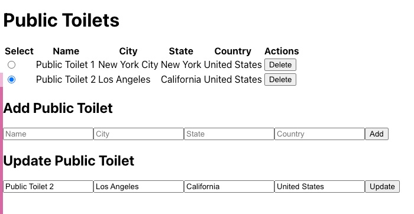

# Chapter 1: Building a Simple ReactJS Application 
In this chapter, we will focus on building a simple ReactJS UI app with basic CRUD (Create, Read, Update, and Delete) operations. The app will be about **Public Toilets** listing where the user can add, update, remove public toilets, and view the list of public toilets. We will use an in-memory array in the UI app for CRUD operations.
:::tip
This workshop focuses on providing you with hands-on experience in building a complete solution for Front-End UI, Backend API, database, and cloud deployment. While we cover the technologies used in this workshop, we may not be able to delve into each technology in depth. Therefore, we recommend further studying all the technologies and frameworks by referring to their documentation. Refer to [Futher Learning Section](#further-learning) for resrouces.
:::

## 1. Setting up the Development Environment
Before we start building our app, we need to set up the development environment. To build the UI app, we will use Node.js and ReactJS. Follow these steps to set up the development environment:

### Install Node.JS
1. Open your terminal or command prompt.

1. Install `Node.js` from the official website if you haven't already. You can download it from here: https://nodejs.org/en/download/.

1. To verify that `Node.js` has been installed successfully, open your terminal and run the following command:
    ```
    node -v
    ```
   If the command returns the version of `Node.js`, it means that `Node.js` has been installed correctly.

1. Install `npx` globally using `npm` (Node Package Manager) by running the following command:
  :::info
  npx is a command-line utility built into npm (Node Package Manager) version 5.2 or later. It is used to execute Node.js packages without having to install them globally. 
  :::

   ```
   npm install -g npx
   ```
### Create ReactJs App
1. Create a new ReactJS app named `public-toilets-app` by running the following command:
   ```
   npx create-react-app public-toilets-app
   ```
     If you get the following message, say yes and enter.
     
     `Need to install the following packages: create-react-app@x.x.x
      Ok to proceed? (y) y`

1. Once the app is created, navigate to the `public-toilets-app` directory by running the following command:
   ```
   cd public-toilets-app
   ```
1. Install the necessary dependencies.
   To install the necessary dependencies, run the following command:
   ```
   npm install
   ```
### Run React App

Once you have generated the initial ReactJS app, navigate to the root directory of the app using the command prompt or terminal and enter the following command:
  ```
  npm start run
  ```
This will start the development server and open the app in your default browser at [http://localhost:3000](http://localhost:3000). You can now start making changes to the app and see the changes reflected in the browser in real-time.

if the app is running, you should see the ReactJS default page in the browser.


:::tip
To stop the development server, you can press `CTRL + C` in the command prompt or terminal.
:::

### Open project in IDE

Open the project directory (public-toilets-app) in Visual Studio Code or your preferred text editor or IDE. You should see the files as shown below.


### Github Repo
:::note
  The source code for this section is available in the **initial-react-app** branch of the GitHub repository [public-toilets-app](https://github.com/certifysphere/workshops/tree/main/reactjs-springboot-workshop/public-toilets-app).

  To clone the repository and switch to the **initial-react-app** branch, you can use the following commands:

  ```bash
  git clone --branch initial-react-app https://github.com/certifysphere/workshops.git
  cd workshops/reactjs-springboot-workshop/public-toilets-app/
  ```

  After cloning the repository and navigating to the appropriate directory, you can explore the code and run it locally as per the instructions provided in the workshop.
:::


That's it for this section! 🎉 We now have a new ReactJS app named `public-toilets-app` running. In the next section, we will add actual UI components.


## 2. Create the PublicToilets UI components
Now that we have set up our development environment, let's start creating the UI components for our app. In ReactJS, UI components are created using JSX syntax, which allows you to write HTML-like code in JavaScript.

We will create the following components for our app:

- App.js - The main component that renders other components
- mock-public-toilets-service.js - Provides methods for managing public toilets data

### Mock Backend Service 
This MockPublicToiletService class provides methods for managing public toilets data, such as retrieving the list of public toilets, adding a new public toilet, deleting a public toilet by its id, and updating a public toilet by its id. It utilizes a singleton pattern to ensure only one instance of the service class is created throughout the application.

:::note
  Please note that this is a mock service intended for local testing and will be replaced with an actual service in the subsequent sections of your application.
:::
The provided code snippet represents a singleton JavaScript class, MockPublicToiletService, which acts as a mock service for testing purposes. 

```javascript
  /**
   * Singleton mock service for handling public toilets data.
   */
  export default class MockPublicToiletService {
    static instance;

    // Array to store public toilets data
    publicToilets = [];

    /**
     * Returns the singleton instance of the MockPublicToiletService class.
     * If the instance doesn't exist, it creates a new one.
     * @returns {MockPublicToiletService} The singleton instance.
     */
    static getInstance() {
      if (!MockPublicToiletService.instance) {
        MockPublicToiletService.instance = new MockPublicToiletService();
      }
      return MockPublicToiletService.instance;
    }

    /**
     * Retrieves the list of public toilets.
     * @returns {Promise<Array>} A promise that resolves to the array of public toilets.
     */
    getPublicToilets() {
      return Promise.resolve(this.publicToilets);
    }

    /**
     * Adds a new public toilet to the list.
     * @param {Object} publicToilet - The public toilet object to be added.
     * @returns {Promise<Object>} A promise that resolves to the added public toilet object.
     */
    addPublicToilet(publicToilet) {
      // Get the maximum id from the existing public toilets
      const maxId = this.publicToilets.reduce((max, obj) => Math.max(max, obj.id), 0);

      // Assign a new id to the public toilet
      publicToilet.id = maxId + 1;

      // Add the public toilet to the list
      this.publicToilets.push(publicToilet);

      return Promise.resolve(publicToilet);
    }

    /**
     * Deletes a public toilet from the list by its id.
     * @param {number} id - The id of the public toilet to be deleted.
     */
    deletePublicToilet(id) {
      this.publicToilets = this.publicToilets.filter(publicToilet => publicToilet.id !== id);
    }

    /**
     * Updates a public toilet in the list by its id.
     * @param {number} id - The id of the public toilet to be updated.
     * @param {Object} publicToilet - The updated public toilet object.
     */
    updatePublicToilet(id, publicToilet) {
      this.publicToilets = this.publicToilets.map(item => (item.id === id ? publicToilet : item));
    }
  }
  ```
  ### App.js component
  The App.js file serves as the entry point and main component of a React application. It is responsible for rendering the user interface and managing the state and behavior of the application.
  
  The App.js file typically contains the root component that represents the entire application. It defines the structure and layout of the application's UI by composing and rendering other components. It also manages the application's state and handles any necessary data fetching, updates, or event handling.
  
:::info
  We are adding all of the initial UI components in the same App.js file for simplicity. We are not using any CSS or UI framework at the moment. However, in later chapters, we will refactor our code by moving these components into separate files to improve organization and modularity. See [Further Learning](#further-learning) section for UI and Javascript frameworks. 
:::

  ```javascript
  import React, { useState, useEffect } from 'react';
  import MockPublicToiletService from './service/mock-public-toilets-service';

  const App = () => {
    // State variables
    const [publicToilets, setPublicToilets] = useState([]);
    const [selectedPublicToilet, setSelectedPublicToilet] = useState(null);

    // Mock service instance
    const service = MockPublicToiletService.getInstance();

    // Fetches public toilets data when the component mounts
    useEffect(() => {
      getPublicToilets();
    }, []);


    // Fetches the list of public toilets
    const getPublicToilets = async () => {
      try {
        const list = await service.getPublicToilets();
        setPublicToilets(list);
      } catch (error) {
        console.log('Error fetching public toilets:', error);
      }
    };

    // Deletes a public toilet
    const deleteToilet = async (id) => {
      try {
        await service.deletePublicToilet(id);
        getPublicToilets();
      } catch (error) {
        console.log('Error deleting public toilet:', error);
      }
    };

    // Updates a public toilet
    const updateToilet = async (selectedPublicToilet) => {
      try {
        await service.updatePublicToilet(selectedPublicToilet.id, selectedPublicToilet);
        getPublicToilets();
      } catch (error) {
        console.log('Error updating public toilet:', error);
      }
    };

    // Adds a new public toilet
    const addPublicToilet = async (publicToilet) => {
      try {
        await service.addPublicToilet(publicToilet);
        setPublicToilets([]);
        getPublicToilets();
      } catch (error) {
        console.log('Error adding public toilet:', error);
      }
    };

    // Renders the table of public toilets
    const renderPublicToilets = () => {
      //Display message when publicToilets array is empty
      if (!publicToilets || publicToilets.length === 0) {
        return <p>No Data Found</p>;
      }

      return (
        <table>
          {/* Table headers */}
          <thead>
            <tr>
              <th>Select</th>
              <th>Name</th>
              <th>City</th>
              <th>State</th>
              <th>Country</th>
              <th>Actions</th>
            </tr>
          </thead>
          {/* Table body */}
          <tbody>
            {publicToilets.map((publicToilet) => (
              <tr key={publicToilet.id}>
                {/* Radio button for selection */}
                <td>
                  <input
                    type='radio'
                    name='publicToiletRecord'
                    onClick={() => setSelectedPublicToilet(publicToilet)}
                  />
                </td>
                <td>{publicToilet.name}</td>
                <td>{publicToilet.city}</td>
                <td>{publicToilet.state}</td>
                <td>{publicToilet.country}</td>
                <td>
                  {/* Delete button */}
                  <button onClick={() => deleteToilet(publicToilet.id)}>Delete</button>
                </td>
              </tr>
            ))}
          </tbody>
        </table>
      );
    };


    // Handles the form submission for adding a
    const handleSubmit = (event) => {
      event.preventDefault();
      const { name, city, state, country } = event.target.elements;
      const publicToilet = {
        name: name.value,
        city: city.value,
        state: state.value,
        country: country.value,
      };
      addPublicToilet(publicToilet);
      event.target.reset();
    };


    //Display Add a new PublicToilet form
    const renderAddPublicToiletForm = () => {
      return (
        <div >
          <h2>Add Public Toilet</h2>
          <form onSubmit={handleSubmit}>
            <input name="name" placeholder="Name" />
            <input name="city" placeholder="City" />
            <input name="state" placeholder="State" />
            <input name="country" placeholder="Country" />
            <button type="submit">Add</button>
          </form>
        </div>
      );
    };

    //Display Update a PublicToilet form
    const renderUpdatePublicToiletForm = () => {
      const handleChange = (event) => {
        setSelectedPublicToilet({
          ...selectedPublicToilet,
          [event.target.name]: event.target.value,
        });
      };

      return (
        <>
          <h2>Update Public Toilet</h2>
          <input type='hidden' defaultValue={selectedPublicToilet.id} />
          <input name="name" value={selectedPublicToilet.name} onChange={handleChange} placeholder="Name" />
          <input name="city" value={selectedPublicToilet.city} onChange={handleChange} placeholder="City" />
          <input name="state" value={selectedPublicToilet.state} onChange={handleChange} placeholder="State" />
          <input name="country" value={selectedPublicToilet.country} onChange={handleChange} placeholder="Country" />
          <button onClick={() => updateToilet(selectedPublicToilet)}>Update</button>
        </>
      );
    };


    //Returns PublicToilets list, Add and Update component  
    return (
      <>
        <h1>Public Toilets</h1>
        {renderPublicToilets()}
        {renderAddPublicToiletForm()}
        {selectedPublicToilet && renderUpdatePublicToiletForm()}
      </>
    );
  };

  export default App;
  ```
  Here's a summary of each method in the `App.js`:

  1. `getPublicToilets`: Fetches the list of public toilets using the service and sets the `publicToilets` state with the retrieved data.

  1. `deleteToilet`: Deletes a public toilet based on the provided ID. It calls the service to delete the toilet and then fetches the updated list of public toilets.

  1. `updateToilet`: Updates a public toilet with the new data of the selected public toilet. It calls the service to update the toilet and then fetches the updated list of public toilets.

  1. `addPublicToilet`: Adds a new public toilet by calling the service to add it. It resets the `publicToilets` state, fetches the updated list of public toilets.

  1. `renderPublicToilets`: Renders the table of public toilets. It displays a message of "No Data Found" when the `publicToilets` array is null or empty. Otherwise, it maps over the array and renders the table rows for each public toilet.

  1. `handleSubmit`: Handles the form submission when adding a public toilet. It extracts the form data, creates a new public toilet object, calls `addPublicToilet` method, and resets the form.

  1. `renderAddPublicToiletForm`: Renders the form for adding a new public toilet. It includes input fields for name, city, state, and country, and a submit button.

  1. `renderUpdatePublicToiletForm`: Renders the form for updating a public toilet. It includes input fields for name, city, state, and country, pre-filled with the selected public toilet data. It handles changes in the input fields using a single `handleChange` method that updates the corresponding state property.

  These methods collectively provide functionality for fetching, adding, updating, and deleting public toilets, as well as rendering the UI components for displaying and interacting with the data.

### Github Repo
:::note
  You can refer to and clone the code up to this section from the GitHub repository using the `with-in-memory-datastore` branch.

  To clone the repository, you can use the following command:

  ```bash
  git clone --branch with-in-memory-datastore https://github.com/certifysphere/workshops.git
  ```

  This will clone the repository and checkout the `with-in-memory-datastore` branch, which contains the code up to this section of the workshop.

  You can then navigate to the `public-toilets-app` directory to access the React app code:

  ```bash
  cd workshops/reactjs-springboot-workshop/public-toilets-app/
```

From there, you can explore the code and continue with the workshop.
:::

### Testing

Let's test our app in the browser by adding, updating, and deleting some data.

1. If you are following along and have the source code in the `public-toilets-app` directory, navigate to the `public-toilets-app` directory:
   ```
   cd public-toilets-app
   ```
   OR
   ```bash
   git clone https://github.com/certifysphere/workshops.git
   cd workshops/reactjs-springboot-workshop/public-toilets-app/
   ```

2. Install the dependencies:
   ```
   npm install
   ```

3. Start the server:
   ```
   npm start
   ```
   It should open the `localhost:3000` URL in the browser. You should be able to see our initial app without any data.

4. Perform Add, Update, and Delete operations. You should see the screen like the one shown below. You can test it with dummy data.

   

Make sure to test the functionality thoroughly and ensure that the app behaves as expected when adding, updating, and deleting data.  


## Further Learning  

Here are some recommended resources for further reading on front-end development:

### ReactJS Documentation
 The official documentation is a comprehensive resource that covers all aspects of ReactJS, including the core concepts, API reference, and guides. It's a great starting point for learning ReactJS. 
 
 You can access it at: **https://react.dev/learn**

### HTML Tutorial
 MDN Web Docs: MDN Web Docs provides an in-depth tutorial on HTML, covering the basics as well as more advanced topics. It includes code examples, explanations, and references to HTML elements and attributes. 
 
 You can find the tutorial here: **https://developer.mozilla.org/en-US/docs/Glossary/HTML**
 
 You can also try learning and experimenting with HTML on the W3Schools website: **https://www.w3schools.com/html/**

### Bootstrap Documentation
 Bootstrap is a popular CSS framework that provides pre-built components and styling for building responsive web applications. The official documentation offers guidance on using Bootstrap's components, grid system, and utility classes. 
 
 You can explore the documentation at: **https://getbootstrap.com/docs/5.1/getting-started/introduction/**

### React-Bootstrap
 React-Bootstrap is a library that integrates Bootstrap components into React applications, allowing you to use Bootstrap's components as React components. It provides a wide range of pre-styled components that are easy to use and customize. 
 
 You can find the documentation and examples at: **https://react-bootstrap.github.io/**

### React Router
 React Router is a popular library for handling routing in React applications. It allows you to define routes and navigation within your app, enabling navigation between different components. 
 
 The official documentation provides a comprehensive guide on how to use React Router: **https://reactrouter.com/**

### React Hooks
 React Hooks are a feature introduced in React 16.8 that allows you to use state and other React features in functional components. Hooks provide a more concise and flexible way to manage state and lifecycle in React applications. 
 
 You can learn more about React Hooks in the official documentation: **https://react.dev/reference/react**

These resources should give you a solid foundation in front-end development with ReactJS, HTML, and Bootstrap. Remember to practice building projects and experiment with different concepts to reinforce your learning.

