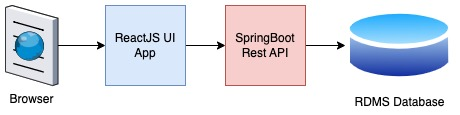

# Workshop Overview - FrontEnd app (ReactJS), Backend Rest API(Springboot)
In this workshop, we will be learning how to build a simple but functional web application that follows a 3-tier architecture pattern. The workshop will follow the principles outlined below:
1. The workshop is divided into multiple parts, with each part building a functional component of the overall system.
2. Each subsequent part will add new functionality, starting with simple features and gradually adding more advanced ones.
3. Project ideas will be kept realistic so that students can relate to them in the real world.
4. Project ideas will be divided into multiple epics and stories, as in any big organization.
5. One epic will be completed in each part of the workshop.
Code for each part can be downloaded from the GitHub repository.

## 3- Tier Architecture 

A 3-tier architecture pattern separates an application into three distinct layers: presentation layer, business logic layer, and data storage layer. The presentation layer, or UI layer, is responsible for rendering the application user interface. The business logic layer, or middle tier, is responsible for processing requests and responses between the UI layer and data storage layer. The data storage layer is responsible for storing and retrieving application data.

## Tech Stack
Choosing a tech stack for a project is a tough decision as there are many popular frameworks and programming languages for each layer of the 3-tier architecture. For the initial parts of this workshop, we will use the following framework and programming languages:
1. ReactJS for UI development. Learn more ReactJS from offical website (https://react.dev/learn)
2. Java and Spring Boot for REST API backend application. Learn more Spring framework from official guides (https://spring.io/guides/gs/rest-service/)
3. PostgreSQL for databases. Learn more at PostgreSQL site (https://www.postgresqltutorial.com/)

As we move to more advanced topics, we will deploy our applications to AWS Cloud and replace some of these tech stacks with other cloud-native services.

## Project
In this workshop, we will be building a simple application that allows users to manage a list of public toilets. The UI layer of the application will be built using ReactJS, the middle tier will be built using Spring Boot, and the data storage layer will be built using PostgreSQL.

### Epics and Stories 
Epics and stories are commonly used in agile software development as a way to break down a project into smaller, more manageable pieces. An epic is a large body of work that can be broken down into smaller pieces of work called stories. Stories are more specific and smaller units of work that can be completed in a shorter time frame.

As we are trying to keep this workshop more realistic to the culture of big organizations, we will also divide our project into multiple epics and stories.

- Epic 1: Building the React UI
    - Story 1: Setting up the development environment
    - Story 2: Creating the UI layout and design
    - Story 3: Implementing the UI components for displaying public toilets
    - Story 4: Implementing the UI components for adding new public toilets
    - Story 5: Implementing the UI components for updating and deleting public toilets
- Epic 2: Building the Spring Boot API
    - Story 1: Setting up the development environment
    - Story 2: Creating the API endpoints for retrieving public toilets
    - Story 3: Creating the API endpoint for adding new public toilets
    - Story 4: Creating the API endpoint for updating public toilets
    - Story 5: Creating the API endpoint for deleting public toilets
- Epic 3: Integrating the React UI with the Spring Boot API
    - Story 1: Adding API calls to retrieve public toilets from the Spring Boot API
    - Story 2: Adding API calls to add new public toilets through the Spring Boot API
    - Story 3: Adding API calls to update existing public toilets through the Spring Boot API
    - Story 4: Adding API calls to delete public toilets through the Spring Boot API
    - Story 5: Testing the integration between the React UI and Spring Boot API
- Epic 4: Adding Authentication and Authorization
    - Story 1: Setting up the authentication and authorization framework
    - Story 2: Implementing user registration and login functionality
    - Story 3: Restricting access to the UI and API endpoints based on user roles
    - Story 4: Implementing password reset functionality
    - Story 5: Testing the authentication and authorization functionality
- Epic 5: Deploying to the Cloud
    - Story 1: Setting up the AWS environment
    - Story 2: Configuring the application to run on AWS
    - Story 3: Deploying the React UI to AWS
    - Story 4: Deploying the Spring Boot API to AWS
    - Story 5: Testing the deployed application on AWS
## Tools 
I am using Visual Studio Code as my code editor for the development of this app. You can use the same code editor or any other that you are comfortable with. Here are some popular development tools that you may find helpful for this workshop:

1. [Visual Studio Code](https://code.visualstudio.com/): A lightweight and versatile code editor with great support for React and Java development.

1. [IntelliJ IDEA](https://www.jetbrains.com/idea/): A popular and powerful integrated development environment (IDE) for Java development with advanced code analysis and debugging tools.

1. [Postman](https://www.postman.com/): A powerful tool for testing and debugging RESTful APIs.

1. [Git](https://git-scm.com/downloads): A version control system that allows you to keep track of changes to your code and collaborate with others.

1. [GitHub](https://github.com/): A web-based platform for hosting Git repositories and collaborating on projects with others.

## References
Here are some references that you can use to further enhance your skills related to the technologies used in this workshop:

- **ReactJS**
  - Official ReactJS Documentation: https://react.dev/learn
- **Spring Boot**
  - Official Spring Boot Documentation: https://spring.io/projects/spring-boot
- **PostgreSQL**
  - Official PostgreSQL Documentation: https://www.postgresql.org/docs/

Additionally, you can also refer to the documentation and tutorials provided by the development tools that you will be using in this workshop, such as Visual Studio Code, Git, and GitHub.

By the end of this workshop, you will have a basic understanding of the 3-tier architecture pattern and how to build a web application using ReactJS, Spring Boot, and PostgreSQL. You will also be able to extend the application with additional features and functionality. So, let's get started!

