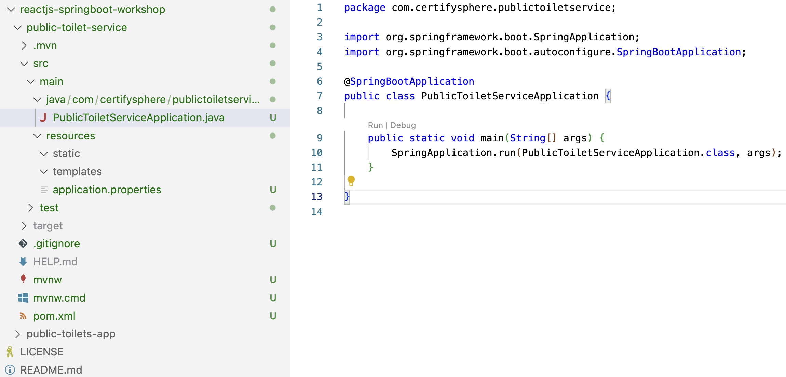

# Chapter 2: Building a Spring Boot Backend REST API for CRUD Operations

In this chapter, we will focus on creating a Spring Boot application that serves as a backend REST API for performing CRUD (Create, Read, Update, Delete) operations on Public Toilets. We will utilize an in-memory H2 database to store the data temporarily. In the subsequent chapter, we will replace the in-memory data store with a persistent database.

:::info
This chapter is part of the ReactJS and Spring Boot workshop series. It can be followed independently if you are interested in creating a simple Spring Boot application. However, for a comprehensive understanding, we recommend following the complete series, which can be found [here](1-introduction.md).
:::

## Setting up the Development Environment

Before we start developing the Spring backend Rest Services, it's important to ensure that your local environment is set up for Java development. Please follow the instructions provided in the [**Install Java Development Tools**](../../tutorials/developer-environment-setup/install-java-development-tools) tutorial to set up your local system.

Once you have completed the setup and confirmed that your environment is ready for Java development, you can come back to this tutorial and continue with the next steps.

## Step 1: Creating a New Spring Boot Project
To get started, let's create a new Spring Boot project using the Spring Initializr. Follow the steps below:

1. Go to [**start.spring.io**](https://start.spring.io/).
2. Choose the following project options:
   - Project: Maven Project
   - Language: Java
   - Spring Boot: 2.7.11 (or Latest Version)
   - Group: com.certifysphere
   - Artifact: public-toilet-service
   - Description: Backend Rest Services for Public Toilets App
   - Packaging: Jar
   - Java: 11
3. Click on "Add Dependencies" and add the following dependencies:
   - Spring Web
   - Spring Data JPA
   - H2 Database
4. Click on "Generate" to download the project.

:::info
You can use this link to generate and download the pre-configured base project: [**start.spring.io pre-configured link**](https://start.spring.io/#!type=maven-project&language=java&platformVersion=2.7.11&packaging=jar&jvmVersion=11&groupId=com.certifysphere&artifactId=public-toilet-service&name=public-toilet-service&description=Backend%20Rest%20Services%20for%20Public%20Toilets%20App&packageName=com.certifysphere.public-toilet-service&dependencies=web,data-jpa,h2)
:::

5. When you click on "Generate," it should download a zip file. Move this file to the workshop root folder (reactjs-springboot-workshop) and unzip it. You should have the following directory structure:

```
reactjs-springboot-workshop/
  ├── public-toilet-app/
  └── public-toilet-service/
```

6. Open the `public-toilet-service` directory in VS Code:
```bash
cd reactjs-springboot-workshop/public-toilet-service/
```

7. Build the project using Maven to ensure our environment is properly set up:
```bash
./mvnw clean package
```
Or
```bash
mvn clean package
```
You should see `BUILD SUCCESS` if everything is properly set up.

8. Run the Service:
   - We can run our backend service app from the terminal or command prompt or from VS Code.
   - In VS Code, you should see a "run" option on top of our main class, `PublicToiletServiceApplication`. (See Screenshot below.)
   - Click on the run option, and you should see the following log message in the end of console window:

   ```
    INFO 52563 --- [main] c.c.p.PublicToiletServiceApplication: Started PublicToiletServiceApplication in 3.033 seconds (JVM running for 3.48)
   ```
   - If the application doesn't start, troubleshoot the error before moving to the next step.
   - SpringBoot VS Code Run Option
    

### Github Repo
:::note
  You can also refer to and clone the code up to this section from the GitHub repository using the `with-initial-backend-service` branch.

  To clone the repository, you can use the following command:

  ```bash
  git clone --branch with-initial-backend-service https://github.com/certifysphere/workshops.git
  ```

  This will clone the repository and checkout the `with-initial-backend-service` branch, which contains the code up to this section of the workshop.

  You can then navigate to the `public-toilet-service` directory to access the Java and Spring Rest Services code:

  ```bash
  cd workshops/reactjs-springboot-workshop/public-toilet-service/
```
:::

## Step 2: Defining the Entity Class
Next, let's define the entity class that represents a public toilet. Create a new class called "PublicToilet" in the "com.certifysphere.publictoiletapi" package and add the following code:

```java
package com.certifysphere.publictoiletapi.model;

import javax.persistence.Entity;
import javax.persistence.GeneratedValue;
import javax.persistence.GenerationType;
import javax.persistence.Id;

@Entity
public class PublicToilet {

    @Id
    @GeneratedValue(strategy = GenerationType.AUTO)
    private Long id;
    private String name;
    private String location;
    private int rating;

    public PublicToilet() {}

    public PublicToilet(String name, String location, int rating) {
        this.name = name;
        this.location = location;
        this.rating = rating;
    }

    public Long getId() {
        return id;
    }

    public void setId(Long id) {
        this.id = id;
    }

    public String getName() {
        return name;
    }

    public void setName(String name) {
        this.name = name;
    }

    public String getLocation() {
        return location;
    }

    public void setLocation(String location) {
        this.location = location;
    }

    public int getRating() {
        return rating;
    }

    public void setRating(int rating) {
        this.rating = rating;
    }

    @Override
    public String toString() {
        return "PublicToilet{" +
                "id=" + id +
                ", name='" + name + '\'' +
                ", location='" + location + '\'' +
                ", rating=" + rating +
                '}';
    }
}
```

In this code, we define a "PublicToilet" entity class with four properties: "id", "name", "address", and "rating". The "@Entity" annotation tells Spring that this class should be mapped to a database table.

## Step 3: Creating the Repository
Now that we have defined the entity class, let's create a repository interface for it. Create a new interface called "PublicToiletRepository" in the "com.certifysphere.publictoiletapi.repository" package and add the following code:

```java
package com.certifysphere.publictoiletapi.repository;

import com.certifysphere.publictoiletapi.model.PublicToilet;
import org.springframework.data.jpa.repository.JpaRepository;
import org.springframework.stereotype.Repository;

@Repository
public interface PublicToiletRepository extends JpaRepository<PublicToilet, Long>

```

In this code, we define a "PublicToiletRepository" interface that extends the "JpaRepository" interface provided by Spring Data JPA. This interface provides methods for performing CRUD operations on the "PublicToilet" entity.

# Step 4: Creating the Service 
```java
package com.certifysphere.service;

import com.certifysphere.model.Toilet;
import com.certifysphere.repository.ToiletRepository;
import org.springframework.beans.factory.annotation.Autowired;
import org.springframework.stereotype.Service;

import java.util.List;
import java.util.Optional;

@Service
public class ToiletService {

    @Autowired
    private ToiletRepository toiletRepository;

    public List<Toilet> getAllToilets() {
        return toiletRepository.findAll();
    }

    public Optional<Toilet> getToiletById(Long id) {
        return toiletRepository.findById(id);
    }

    public Toilet createOrUpdateToilet(Toilet toilet) {
        return toiletRepository.save(toilet);
    }

    public void deleteToiletById(Long id) {
        toiletRepository.deleteById(id);
    }
}

```
## Step 4: Creating the Controller
Next, let's create a REST controller for our API. Create a new class called "PublicToiletController" in the "com.certfysphere.publictoiletapi.controller" package and add the following code:

```java
package com.certifysphere.controller;

import com.certifysphere.model.Toilet;
import com.certifysphere.service.ToiletService;
import org.springframework.beans.factory.annotation.Autowired;
import org.springframework.http.HttpStatus;
import org.springframework.http.ResponseEntity;
import org.springframework.web.bind.annotation.*;

import java.util.List;

@RestController
@RequestMapping("/toilets")
public class ToiletController {

    @Autowired
    ToiletService toiletService;

    @GetMapping
    public ResponseEntity<List<Toilet>> getAllToilets() {
        List<Toilet> list = toiletService.getAllToilets();
        return new ResponseEntity<List<Toilet>>(list, HttpStatus.OK);
    }

    @GetMapping("/{id}")
    public ResponseEntity<Toilet> getToiletById(@PathVariable("id") long id) {
        Toilet toilet = toiletService.getToiletById(id);
        return new ResponseEntity<Toilet>(toilet, HttpStatus.OK);
    }

    @PostMapping
    public ResponseEntity<Toilet> createToilet(@RequestBody Toilet toilet) {
        Toilet newToilet = toiletService.createToilet(toilet);
        return new ResponseEntity<Toilet>(newToilet, HttpStatus.CREATED);
    }

    @PutMapping("/{id}")
    public ResponseEntity<Toilet> updateToilet(@PathVariable("id") long id, @RequestBody Toilet toilet) {
        Toilet updatedToilet = toiletService.updateToilet(id, toilet);
        return new ResponseEntity<Toilet>(updatedToilet, HttpStatus.OK);
    }

    @DeleteMapping("/{id}")
    public ResponseEntity<String> deleteToilet(@PathVariable("id") long id) {
        toiletService.deleteToilet(id);
        return new ResponseEntity<String>("Toilet deleted successfully!", HttpStatus.OK);
    }

}
```
## Testing 
We can test the Public Toilets Services CRUD operations of the service using curl or Postman. 
Here are some examples:

- GET all public toilets:

```sh
curl -X GET http://localhost:8080/api/public-toilets
```

- GET a specific public toilet by id:

```sh
curl -X GET http://localhost:8080/api/public-toilets/{id}
```

- POST a new public toilet:

```sh
curl -X POST \
  http://localhost:8080/api/public-toilets \
  -H 'Content-Type: application/json' \
  -d '{
        "name": "Public Toilet 1",
        "location": "123 Main Street",
        "isAvailable": true
    }'
```

- PUT update an existing public toilet:

```sh
curl -X PUT \
  http://localhost:8080/api/public-toilets/{id} \
  -H 'Content-Type: application/json' \
  -d '{
        "name": "Updated Public Toilet",
        "location": "456 New Street",
        "isAvailable": false
    }'
```

- DELETE a public toilet by id:

```sh
curl -X DELETE http://localhost:8080/api/public-toilets/{id}
```
### Unit Testing 
Here are some examples of unit tests that you can write for the REST services:

1. Test to verify if the service returns all toilets:

```java
@Test
public void getAllToiletsTest() {
    List<Toilet> toiletList = Arrays.asList(
        new Toilet("Mumbai", "Churchgate", "Western"),
        new Toilet("Delhi", "Red Fort", "North"),
        new Toilet("Bangalore", "MG Road", "South")
    );
    Mockito.when(toiletRepository.findAll()).thenReturn(toiletList);
    List<Toilet> result = toiletService.getAllToilets();
    assertEquals(3, result.size());
}
```

2. Test to verify if the service returns a toilet by id:

```java
@Test
public void getToiletByIdTest() {
    Toilet toilet = new Toilet("Mumbai", "Churchgate", "Western");
    Mockito.when(toiletRepository.findById(1L)).thenReturn(Optional.of(toilet));
    Toilet result = toiletService.getToiletById(1L);
    assertEquals("Mumbai", result.getCity());
    assertEquals("Churchgate", result.getLocation());
    assertEquals("Western", result.getZone());
}
```

3. Test to verify if the service adds a new toilet:

```java
@Test
public void addNewToiletTest() {
    Toilet toilet = new Toilet("Mumbai", "Churchgate", "Western");
    Mockito.when(toiletRepository.save(toilet)).thenReturn(toilet);
    Toilet result = toiletService.addNewToilet(toilet);
    assertEquals("Mumbai", result.getCity());
    assertEquals("Churchgate", result.getLocation());
    assertEquals("Western", result.getZone());
}
```

These are just some basic examples of unit tests. You can add more tests to verify different scenarios and edge cases.