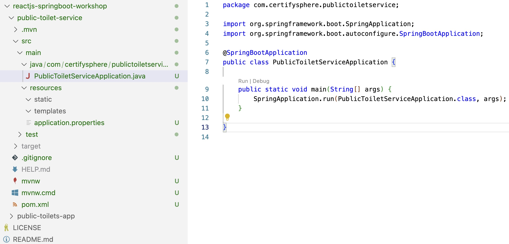

# Chapter 2: Building a Spring Boot Backend REST API for CRUD Operations - Part-1

In this chapter, we will focus on creating a Spring Boot application that serves as a backend REST API for performing CRUD (Create, Read, Update, Delete) operations on Public Toilets. We will utilize an in-memory H2 database to store the data temporarily. In the subsequent chapter, we will replace the in-memory data store with a persistent database.

:::info
This chapter is part of the ReactJS and Spring Boot workshop series. It can be followed independently if you are interested in creating a simple Spring Boot application. However, for a comprehensive understanding, we recommend following the complete series, which can be found [here](1-introduction.md).
:::

### Setting up the Development Environment

Before we start developing the Spring backend Rest Services, it's important to ensure that your local environment is set up for Java development. Please follow the instructions provided in the [**Install Java Development Tools**](../../tutorials/developer-environment-setup/install-java-development-tools) tutorial to set up your local system.

Once you have completed the setup and confirmed that your environment is ready for Java development, you can come back to this tutorial and continue with the next steps.

## Creating a New Spring Boot Project
To get started, let's create a new Spring Boot project using the Spring Initializr. Follow the steps below:

1. Go to [**start.spring.io**](https://start.spring.io/).
2. Choose the following project options:
   - Project: Maven Project
   - Language: Java
   - Spring Boot: 2.7.11 (or Latest Version)
   - Group: com.certifysphere
   - Artifact: public-toilet-service
   - Description: Backend Rest Services for Public Toilets App
   - Packaging: Jar
   - Java: 11
3. Click on "Add Dependencies" and add the following dependencies:
   - Spring Web
   - Spring Data JPA
   - H2 Database
4. Click on "Generate" to download the project.

:::info
You can use this link to generate and download the pre-configured base project: [**start.spring.io pre-configured link**](https://start.spring.io/#!type=maven-project&language=java&platformVersion=2.7.11&packaging=jar&jvmVersion=11&groupId=com.certifysphere&artifactId=public-toilet-service&name=public-toilet-service&description=Backend%20Rest%20Services%20for%20Public%20Toilets%20App&packageName=com.certifysphere.public-toilet-service&dependencies=web,data-jpa,h2)
:::

5. When you click on "Generate," it should download a zip file. Move this file to the workshop root folder (reactjs-springboot-workshop) and unzip it. You should have the following directory structure:

```
reactjs-springboot-workshop/
  ├── public-toilet-app/
  └── public-toilet-service/
```

6. Open the `public-toilet-service` directory in VS Code:
```bash
cd reactjs-springboot-workshop/public-toilet-service/
```

### Build the project
 Build the project using Maven to ensure our environment is properly set up:
```bash
./mvnw clean package
```
Or
```bash
mvn clean package
```
You should see `BUILD SUCCESS` if everything is properly set up.

### Run the Service:
   - We can run our backend service app from the terminal or command prompt or from VS Code.
    ```bash
    ./mvnw spring-boot:run
    ```
    This will start the Public Toilet Service on a local server.

   - In VS Code, you should see a "run" option on top of our main class, `PublicToiletServiceApplication`. (See Screenshot below.)
   - Click on the run option, and you should see the following log message in the end of console window:

   ```
    INFO 52563 --- [main] c.c.p.PublicToiletServiceApplication: Started PublicToiletServiceApplication in 3.033 seconds (JVM running for 3.48)
   ```
   - Access the service: 
        The service will be accessible at `http://localhost:8080`.
   - If the application doesn't start, troubleshoot the error before moving to the next step.
   - SpringBoot VS Code Run Option
    

### Github Repo
:::note
  You can also refer to and clone the code up to this section from the GitHub repository using the `with-initial-backend-service` branch.

  To clone the repository, you can use the following command:

  ```bash
  git clone --branch with-initial-backend-service https://github.com/certifysphere/workshops.git
  ```

  This will clone the repository and checkout the `with-initial-backend-service` branch, which contains the code up to this section of the workshop.

  You can then navigate to the `public-toilet-service` directory to access the Java and Spring Rest Services code:

  ```bash
  cd workshops/reactjs-springboot-workshop/public-toilet-service/
```
:::
