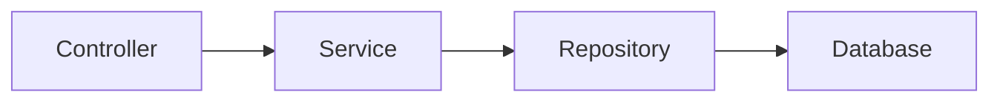

# Chapter 2: Building a Spring Boot Backend REST API for CRUD Operations - Part-2

## Spring Application
In any typical Spring application, we have the following classes and flow:



Here's an explanation of each component in a REST API application:

### Controller:
   - A controller is responsible for handling incoming HTTP requests and returning appropriate responses.
   - It receives requests from clients, processes them, and invokes the corresponding service methods to perform the required business logic.
   - Controllers typically contain methods annotated with HTTP request mappings such as `@GetMapping`, `@PostMapping`, etc., which define the endpoints and HTTP methods they handle.
   - They also handle request parameters, path variables, and request bodies, and may perform validation and conversion.
   - Controllers are responsible for marshaling/unmarshaling data, converting it to the appropriate format (e.g., JSON), and returning it in the response.

### Service:
   - A service class contains the business logic of the application.
   - It encapsulates the processing and manipulation of data, as well as any complex operations required to fulfill the requests.
   - Services are typically responsible for coordinating multiple repository operations to perform higher-level operations.
   - They may apply additional business rules, perform calculations, data transformations, or integrate with external services.
   - Services provide an abstraction layer between the controller and the repository, allowing for separation of concerns and reusability of code.
   - Service methods are typically called by the controller methods to perform the required operations.

### Repository:
   - A repository class is responsible for data access and persistence.
   - It provides an abstraction over the underlying database or data storage technology.
   - Repositories handle the storage, retrieval, updating, and deletion of entities.
   - They interact with the database through the use of queries and provide methods for common data access operations such as CRUD (Create, Read, Update, Delete).
   - Repositories may use an Object-Relational Mapping (ORM) tool like Hibernate or directly interact with the database using SQL queries.
   - They encapsulate the database-specific operations, allowing the service layer to remain independent of the underlying data storage implementation.

By following this flow, the controller receives the HTTP requests, delegates the processing to the service layer, which in turn interacts with the repository for data access and manipulation. The repository then communicates with the underlying database to perform the requested operations.

Remember to complete [Part-1](3-spring-boot-backend-part-1.md) or download the source code from the git branch (as mentioned in Part-1) before starting with this chapter.


:::info
This chapter is part of the ReactJS and Spring Boot workshop series. It can be followed independently if you are interested in creating a simple Spring Boot application. However, for a comprehensive understanding, we recommend following the complete series, which can be found [here](1-introduction.md).
:::

## Step 1: Defining the Entity Class
Next, let's define the entity class that represents a public toilet. Create a new class called "PublicToilet" in the "com.certifysphere.publictoiletservice" package and add the following code:

```java
package com.certifysphere.publictoiletservice.model;

import javax.persistence.Entity;
import javax.persistence.GeneratedValue;
import javax.persistence.GenerationType;
import javax.persistence.Id;

@Entity
public class PublicToilet {
    @Id
    @GeneratedValue(strategy = GenerationType.AUTO)
    private Long id;
    private String name;
    private String city;
    private String state;
    private String country;

    public PublicToilet() {
    }

    public PublicToilet(String name, String city, String state, String country) {
        this.name = name;
        this.city = city;
        this.state = state;
        this.country = country;
    }

    public Long getId() {
        return id;
    }

    public void setId(Long id) {
        this.id = id;
    }

    public String getName() {
        return name;
    }

    public void setName(String name) {
        this.name = name;
    }

    public String getCity() {
        return city;
    }

    public void setCity(String city) {
        this.city = city;
    }

    public String getState() {
        return state;
    }

    public void setState(String state) {
        this.state = state;
    }

    public String getCountry() {
        return country;
    }

    public void setCountry(String country) {
        this.country = country;
    }
    @Override
    public String toString() {
        return "PublicToilet [id=" + id + ", name=" + name + ", city=" + city + ", state=" + state + ", country="
                + country + "]";
    }
}
```

 - In this code, we define a "PublicToilet" entity class with four properties: "id", "name", "city", "state" and "country". 
 - The "@Entity" annotation tells Spring that this class should be mapped to a database table.

## Step 2: Creating the Repository
Now that we have defined the entity class, let's create a repository interface for it. Create a new interface called "PublicToiletRepository" in the "com.certifysphere.publictoiletservice.repository" package and add the following code:

```java
package com.certifysphere.publictoiletservice.repository;

import com.certifysphere.publictoiletservice.model.PublicToilet;
import org.springframework.data.jpa.repository.JpaRepository;
import org.springframework.stereotype.Repository;

@Repository
public interface PublicToiletRepository extends JpaRepository<PublicToilet, Long>{
}
```
 - In this code, we define a "PublicToiletRepository" interface that extends the "JpaRepository" interface provided by Spring Data JPA. 
 - This interface provides methods for performing CRUD operations on the "PublicToilet" entity.

## Step 3: Creating the Service 
```java
package com.certifysphere.publictoiletservice.service;

import com.certifysphere.publictoiletservice.model.PublicToilet;
import com.certifysphere.publictoiletservice.repository.PublicToiletRepository;
import org.springframework.beans.factory.annotation.Autowired;
import org.springframework.stereotype.Service;

import java.util.List;
import java.util.Optional;

@Service
public class PublicToiletService {

    private final PublicToiletRepository publicToiletRepository;

    @Autowired
    public PublicToiletService(PublicToiletRepository publicToiletRepository) {
        this.publicToiletRepository = publicToiletRepository;
    }

    public List<PublicToilet> getAllToilets() {
        return publicToiletRepository.findAll();
    }

    public Optional<PublicToilet> getToiletById(Long id) {
        return publicToiletRepository.findById(id);
    }

    public PublicToilet createToilet(PublicToilet toilet) {
        return publicToiletRepository.save(toilet);
    }

    public PublicToilet updateToilet(Long id, PublicToilet updatedToilet) {
        Optional<PublicToilet> existingToilet = publicToiletRepository.findById(id);

        if (existingToilet.isPresent()) {
            PublicToilet toilet = existingToilet.get();
            toilet.setName(updatedToilet.getName());
            toilet.setCity(updatedToilet.getCity());
            toilet.setState(updatedToilet.getState());
            toilet.setCountry(updatedToilet.getCountry());
            return publicToiletRepository.save(toilet);
        } else {
            throw new RuntimeException("Toilet not found with id: " + id);
        }
    }

    public void deleteToilet(Long id) {
        publicToiletRepository.deleteById(id);
    }
}
```
- It is a service class responsible for handling the business logic related to the `PublicToilet` entity.
- The class is annotated with `@Service` to indicate that it's a Spring service component.
- It has a dependency on the `PublicToiletRepository` interface, which is injected using constructor injection.
- The `getAllToilets()` method retrieves all the public toilets from the repository by calling the `findAll()` method.
- The `getToiletById(Long id)` method retrieves a specific public toilet by its ID from the repository using the `findById()` method.
- The `createToilet(PublicToilet toilet)` method saves a new public toilet to the repository using the `save()` method.
- The `updateToilet(Long id, PublicToilet updatedToilet)` method updates an existing public toilet by its ID.
  - It retrieves the existing toilet from the repository using the `findById()` method.
  - If the toilet exists, its fields (name, city, state, country) are updated with the values from the `updatedToilet` parameter.
  - The updated toilet is then saved back to the repository using the `save()` method.
  - If the toilet does not exist, a `RuntimeException` is thrown.
- The `deleteToilet(Long id)` method deletes a public toilet from the repository by its ID using the `deleteById()` method.

These methods encapsulate the CRUD (Create, Read, Update, Delete) operations for the `PublicToilet` entity and provide the necessary functionality to interact with the underlying data repository.

## Step 4: Creating the Controller
Next, let's create a REST controller for our API. Create a new class called "PublicToiletController" in the "com.certfysphere.publictoiletservice.controller" package and add the following code:

```java
package com.certifysphere.publictoiletservice.controller;

import com.certifysphere.publictoiletservice.model.PublicToilet;
import com.certifysphere.publictoiletservice.service.PublicToiletService;
import org.springframework.beans.factory.annotation.Autowired;
import org.springframework.http.ResponseEntity;
import org.springframework.web.bind.annotation.*;

import java.util.List;
import java.util.Optional;

@RestController
@RequestMapping("/api/public-toilets")
public class PublicToiletController {

    private final PublicToiletService toiletService;

    @Autowired
    public PublicToiletController(PublicToiletService toiletService) {
        this.toiletService = toiletService;
    }

    @GetMapping
    public List<PublicToilet> getAllToilets() {
        return toiletService.getAllToilets();
    }

    @GetMapping("/{id}")
    public ResponseEntity<PublicToilet> getToiletById(@PathVariable Long id) {
        
        Optional<PublicToilet> toiletOptional = toiletService.getToiletById(id);
        
        if (toiletOptional.isPresent()) {
            PublicToilet toilet = toiletOptional.get();
            return ResponseEntity.ok(toilet);
        } else {
            return ResponseEntity.notFound().build();
        }
    }

    @PostMapping
    public PublicToilet createToilet(@RequestBody PublicToilet toilet) {
        return toiletService.createToilet(toilet);
    }

    @PutMapping("/{id}")
    public PublicToilet updateToilet(@PathVariable Long id, @RequestBody PublicToilet updatedToilet) {
        return toiletService.updateToilet(id, updatedToilet);
    }

    @DeleteMapping("/{id}")
    public void deleteToilet(@PathVariable Long id) {
        toiletService.deleteToilet(id);
    }
}

```

- The `PublicToiletController` class is a Spring MVC controller responsible for handling HTTP requests related to the `PublicToilet` entity.
- The class is annotated with `@RestController`, which combines the `@Controller` and `@ResponseBody` annotations. It indicates that this controller will handle RESTful API requests and automatically serialize/deserialize the response/request bodies to/from JSON.
- The base request mapping for the controller is set to `/api/toilets` using the `@RequestMapping` annotation.
- The `PublicToiletController` has a dependency on the `PublicToiletService` interface, which is injected using constructor injection.
- The `getAllToilets()` method handles the HTTP GET request to retrieve all public toilets. It delegates the call to the `toiletService.getAllToilets()` method and returns the list of toilets as the response.
- The `getToiletById(Long id)` method handles the HTTP GET request to retrieve a specific public toilet by its ID. It delegates the call to the `toiletService.getToiletById(id)` method and returns the toilet as the response.
- The `createToilet(PublicToilet toilet)` method handles the HTTP POST request to create a new public toilet. It receives the toilet object as the request body (`@RequestBody` annotation), delegates the call to the `toiletService.createToilet(toilet)` method, and returns the created toilet as the response.
- The `updateToilet(Long id, PublicToilet updatedToilet)` method handles the HTTP PUT request to update an existing public toilet by its ID. It receives the updated toilet object as the request body (`@RequestBody` annotation), delegates the call to the `toiletService.updateToilet(id, updatedToilet)` method, and returns the updated toilet as the response.
- The `deleteToilet(Long id)` method handles the HTTP DELETE request to delete a public toilet by its ID. It delegates the call to the `toiletService.deleteToilet(id)` method and returns no response (void).


## Testing

### Rest API Testing
We can test the Public Toilets Services CRUD operations of the service using CURL or Postman.

Here are some examples:

- First, make sure the Spring Boot app is running. If it's not running already, follow the steps mentioned in [Part 1](springboot-backend-rest-services-part-1.md#run-the-service) to run the service.

- POST a new public toilet:

    ```sh
    curl -X POST \
    http://localhost:8080/api/public-toilets \
    -H 'Content-Type: application/json' \
    -d '{
            "name": "Public Toilet 1",
            "city": "City",
            "state": "State",
            "country": "Country"
        }'
    ```

    This should insert the new toilet record in the H2 Database. You can add 2-3 more records with different data.

- GET all public toilets:

    ```sh
    curl -X GET http://localhost:8080/api/public-toilets
    ```

    This should return all the PublicToilet records that were inserted in the previous step.

- GET a specific public toilet by id:

    ```sh
    curl -X GET http://localhost:8080/api/public-toilets/{id}
    ```

    Replace {id} with a number. The id is an auto-generated sequential field. Try using numbers starting from 1, based on the number of records present in the database.

- PUT update an existing public toilet:

    ```sh
    curl -X PUT \
    http://localhost:8080/api/public-toilets/{id} \
    -H 'Content-Type: application/json' \
    -d '{
            "name": "Updated Public Toilet",
            "city": "Updated City",
            "state": "Updated State",
            "country": "Updated Country"
        }'
    ```

    Replace {id} with a number. This should update the record with the provided id in the database. Try retrieving the record again, and you should see the updated result.

- DELETE a public toilet by id:

    ```sh
    curl -X DELETE http://localhost:8080/api/public-toilets/{id}
    ```

    Again, replace {id} with a number. This should delete the record with the provided id from the database.

:::tip
We used **curl**, an open-source command-line utility, to test the PublicToilets API CRUD operations. You can install `curl` for your operating system from the [curl official website](https://curl.se/). Alternatively, you can also use Postman, a powerful tool for testing and debugging RESTful APIs.
:::


### Unit Testing
 Unit testing is the practice of testing individual units (methods, functions, classes) of code to ensure they function correctly in isolation.

1. Test to verify if the service returns all toilets:

```java
@Test
public void getAllToiletsTest() {
    List<PublicToilet> toiletList = Arrays.asList(
        new PublicToilet("Public Toilet 1", "City 1", "State 1", "Country 1"),
        new PublicToilet("Public Toilet 2", "City 2", "State 2", "Country 2"),
        new PublicToilet("Public Toilet 3", "City 3", "State 3", "Country 3")
    );
    when(toiletRepository.findAll()).thenReturn(toiletList);
    List<PublicToilet> result = toiletService.getAllToilets();
    assertEquals(3, result.size());
}
```

2. Test to verify if the service returns a toilet by id:

```java
@Test
public void getToiletByIdTest() {
    PublicToilet toilet = new PublicToilet("Public Toilet 1", "City 1", "State 1", "Country 1");
    when(toiletRepository.findById(1L)).thenReturn(Optional.of(toilet));
    Optional<PublicToilet> result = toiletService.getToiletById(1L);
    assertTrue(result.isPresent());
    assertEquals("Public Toilet 1", result.get().getName());
    assertEquals("City 1", result.get().getCity());
    assertEquals("State 1", result.get().getState());
    assertEquals("Country 1", result.get().getCountry());
}
```

3. Test to verify if the service adds a new toilet:

```java
 @Test
public void addNewToiletTest() {
    PublicToilet toilet = new PublicToilet("Public Toilet 1", "City 1", "State 1", "Country 1");
    when(toiletRepository.save(toilet)).thenReturn(toilet);
    PublicToilet result = toiletService.createToilet(toilet);
    assertEquals("Public Toilet 1", result.getName());
    assertEquals("City 1", result.getCity());
    assertEquals("State 1", result.getState());
    assertEquals("Country 1", result.getCountry());
}
```

 - These are just some basic examples of unit tests. You can add more tests to verify different scenarios and edge cases. Refer to Github Repository for complete source code of unit test case class. 
 -  JUnit provides the framework for writing and executing unit tests, while Mockito facilitates the creation of mock objects and interactions. The @Mock annotation is used to create mock objects, and the @InjectMocks annotation is used to inject those mock objects into the class under test. Together, they enable effective and isolated unit testing.

## Github Repo
:::note
  You can also refer to and clone the code up to this section from the GitHub repository using the `with-real-classes-rest-backend-service` branch.

  To clone the repository, you can use the following command:

  ```bash
  git clone --branch with-real-classes-rest-backend-service https://github.com/certifysphere/workshops.git
  ```

  This will clone the repository and checkout the `with-real-classes-rest-backend-service` branch, which contains the code up to this section of the workshop.

  You can then navigate to the `public-toilet-service` directory to access the Java and Spring Rest Services code:

  ```bash
  cd workshops/reactjs-springboot-workshop/public-toilet-service/
```
:::