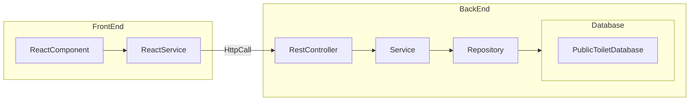

# Chapter 3: Integrating the React UI with the Spring Rest Services



In this chapter, we are integrating the React UI with the Spring Rest Services. Now the frontend React app will make HTTP REST API calls to the backend Spring services for CRUD operations. The backend Spring REST API will store data in an in-memory [**H2 database**](https://www.h2database.com/html/main.html). In the next chapter, we will replace the H2 in-memory database with [**PostgreSQL**](https://www.postgresql.org/).

:::note
This is a follow-up chapter to [**Chapter 1: Building a Simple ReactJS Application**](./2-reactjs-web.md). You can complete Chapter 1 to build the foundational app, or you can download the Chapter 1 source code from the [**Git repository**](https://github.com/certifysphere/workshops.git) and checkout the branch `with-in-memory-datastore`.
:::

### React App Changes
- Add a new service class called `PublicToiletService`. This service class is responsible for making API calls to the backend server for CRUD operations on public toilets.

```javascript
const REST_API_URL = 'http://localhost:8080';
export default class PublicToiletService {
    /**
     * Retrieves the list of public toilets from the backend API.
     * @returns {Promise<Array>} A promise that resolves to the array of public toilets.
     */
    async getPublicToilets() {
        const response = await fetch(REST_API_URL + '/api/public-toilets');
        return await response.json();
    }

    /**
     * Adds a new public toilet to the backend API.
     * @param {Object} publicToilet - The public toilet object to be added.
     * @returns {Promise<Object>} A promise that resolves to the added public toilet object.
     */
    async addPublicToilet(publicToilet) {
        const response = await fetch(REST_API_URL + '/api/public-toilets', {
            method: 'POST',
            headers: {
                'Content-Type': 'application/json',
            },
            body: JSON.stringify(publicToilet),
        });
        return await response.json();
    }

    /**
     * Deletes a public toilet from the backend API by its id.
     * @param {number} id - The id of the public toilet to be deleted.
     */
    async deletePublicToilet(id) {
        fetch(REST_API_URL + `/api/public-toilets/${id}`, {
            method: 'DELETE',
        });
    }

    /**
     * Updates a public toilet in the backend API by its id.
     * @param {number} id - The id of the public toilet to be updated.
     * @param {Object} publicToilet - The updated public toilet object.
     * @returns {Promise<Object>} A promise that resolves to the updated public toilet object.
     */
    async updatePublicToilet(id, publicToilet) {
        const response = await fetch(REST_API_URL + `/api/public-toilets/${id}`, {
            method: 'PUT',
            headers: {
                'Content-Type': 'application/json',
            },
            body: JSON.stringify(publicToilet),
        });
        return await response.json();
    }
}
```

- Replace the usage of `MockPublicToiletService.getInstance()` with `new PublicToiletService()` in `App.js`. This change ensures that the actual API calls are made instead of using the mock service.

```javascript
import PublicToiletService from './service/public-toilet-service';

const App = () => {
  // State variables
  const [publicToilets, setPublicToilets] = useState([]);
  const [selectedPublicToilet, setSelectedPublicToilet] = useState(null);

  // Mock service instance
  //const service = MockPublicToiletService.getInstance();
  
  //Actual Service instance
  const service = new PublicToiletService();
  ...
```

### Spring Rest API Backend Changes
- In the `PublicToiletServiceApplication` class (or any other configuration class), we will add a new bean for [**CORS (Cross-Origin Resource Sharing)**](https://developer.mozilla.org/en-US/docs/Web/HTTP/CORS) configuration. CORS is a mechanism that allows web applications on different origins to access resources from each other.

```java
// PublicToiletServiceApplication.java
// Add this method to allow requests from the React app in local

@Bean
public WebMvcConfigurer corsConfigurer() {
    return new WebMvcConfigurer() {
        @Override
        public void addCorsMappings(CorsRegistry registry) {
            registry
                .addMapping("/**")
                .allowedMethods("HEAD", "GET", "POST", "PUT", "DELETE", "PATCH", "OPTIONS");
        }
    };
}
```

- The `corsConfigurer()` bean is a method that returns a `WebMvcConfigurer` object, which is used for configuring CORS settings.
- Inside the `corsConfigurer()` method, you override the `addCorsMappings()` method of `WebMvcConfigurer`. This method is responsible for defining the CORS mappings and allowed methods.
- In this case, we will define a wildcard mapping (`"/**"`) to allow CORS for all endpoints (`"HEAD"`, `"GET"`, `"POST"`, `"PUT"`, `"DELETE"`, `"PATCH"`, `"OPTIONS"`).
- The purpose of these changes is to enable communication between the React app and the Spring backend server by handling CORS. By allowing the necessary HTTP methods and specifying the wildcard mapping, the backend server will include the appropriate CORS headers in the response, allowing the React app to access the API endpoints. This is just for local development; we don't want to allow cross-origin requests in production applications. We will update this and make it more configurable in the Advanced chapter later.

### Github Repo
:::note
You can refer to and clone the code up to this section from the GitHub repository using the `integrate-reactui-with-spring-rest-services` branch.

To clone the repository, you can use the following command:

```bash
git clone --branch integrate-reactui-with-spring-rest-services https://github.com/certifysphere/workshops.git
```

This will clone the repository and checkout the `integrate-reactui-with-spring-rest-services` branch, which contains the code up to this section of the workshop.

You can then navigate to the `public-toilets-app` directory to access the React app code:

```bash
cd workshops/reactjs-springboot-workshop/public-toilets-app/
```

From there, you can explore the code and continue with the workshop.
:::

### Testing 

1. Start the Spring Boot application by following the instructions in the previous [Chapter 2: Building a Spring Boot Backend REST API for CRUD Operations - Part 1](3-springboot-rest-services-part-1.md#run-the-service).

2. Start the React app by following the instructions in [Chapter 1: Building a Simple ReactJS Application](2-reactjs-web.md#run-react-app).

3.

 If your backend Spring Service is running on a port other than 8080, you can update the new port in the `PublicToiletService.js` file in the React app.

```javascript
// PublicToiletService.js
const REST_API_URL = 'http://localhost:8080'; // update this if the backend API is running on another port
```

4. Test all CRUD operations in the React app as we did in [Chapter 1: Building a Simple ReactJS Application](2-reactjs-web.md#testing).

In this chapter, we used a real REST API and made an HTTP call from the React app to the Spring app. We will deploy both the React and Spring apps to the cloud in the next chapter.